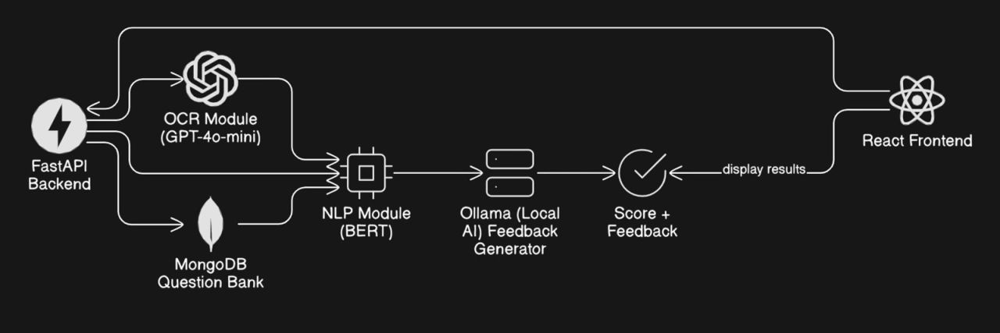
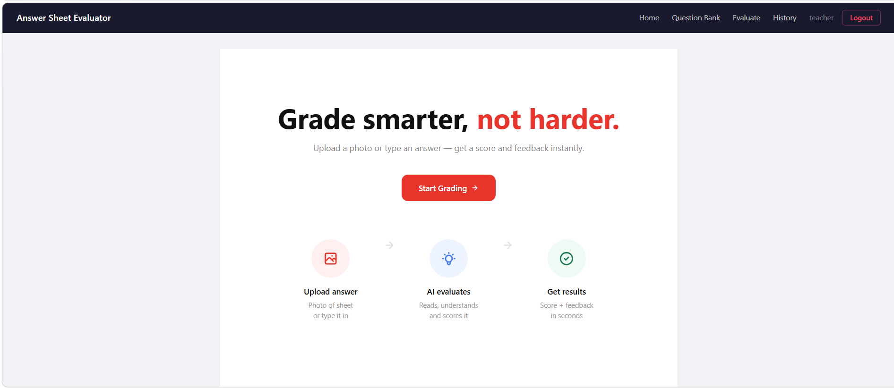
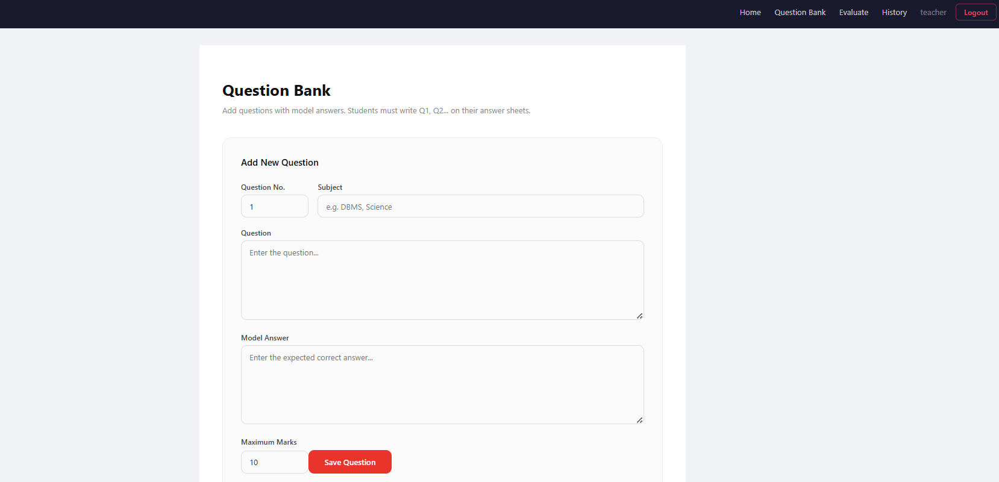
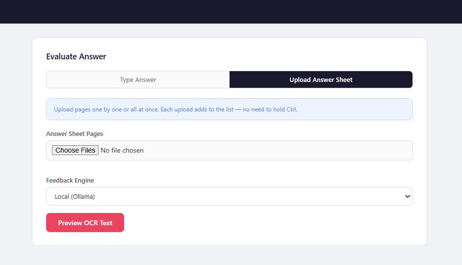
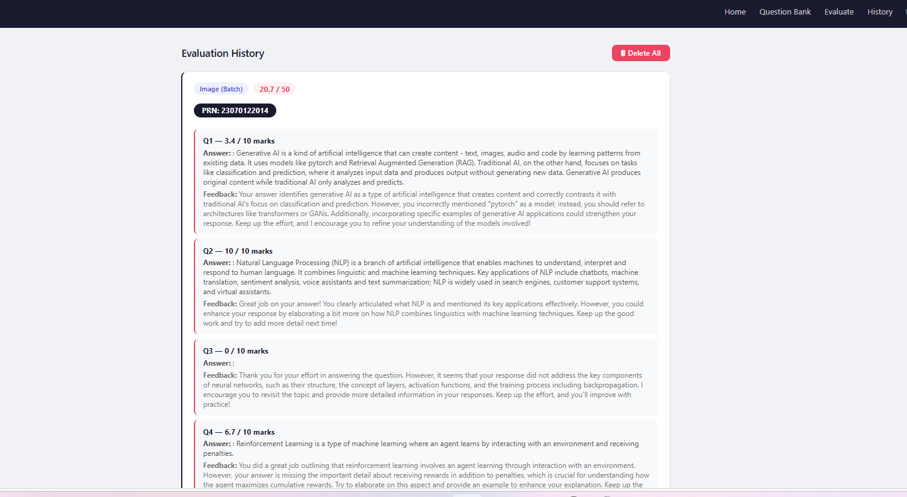

# AI-Powered Handwritten Answer Sheet Evaluator

An AI-driven system that automates the evaluation of handwritten answer sheets using Optical Character Recognition (OCR), Natural Language Processing (NLP), and Large Language Models (LLMs).

The platform extracts handwritten responses, evaluates semantic correctness against model answers, generates scores, and provides intelligent feedback through a complete full-stack application built with React, FastAPI, MongoDB, BERT, GPT, and Ollama.

---

## Overview

Manual answer-sheet evaluation is often time-consuming, inconsistent, and difficult to scale. This project addresses that challenge by introducing an AI-powered evaluation pipeline capable of:

* Extracting handwritten text from answer sheets
* Understanding answer semantics using NLP
* Comparing student answers with model answers
* Generating context-aware scores
* Providing AI-generated feedback
* Supporting multi-page answer-sheet processing
* Maintaining evaluation history

---

## Key Features

### OCR-Based Handwritten Text Extraction

* Extracts handwritten content from answer sheets
* Preserves answer structure and question flow
* Supports multi-page answer processing

### Semantic Answer Evaluation

* Uses transformer-based NLP models (BERT)
* Evaluates answers based on meaning rather than keyword matching
* Supports partial answer detection

### Context-Aware Scoring

* Generates scores based on semantic similarity
* Detects incomplete and contradictory responses
* Provides consistent evaluation criteria

### AI Feedback Generation

* Generates human-like feedback
* Supports local inference using Ollama
* Can integrate with cloud-based LLMs

### Evaluation History Tracking

* Stores previous evaluations
* Allows users to review past results

### Full-Stack Architecture

* React Frontend
* FastAPI Backend
* MongoDB Database
* OCR + NLP + LLM Pipeline

---

## Technology Stack

### Frontend

* React.js
* React Router
* JavaScript
* CSS

### Backend

* FastAPI
* Python

### Database

* MongoDB

### Artificial Intelligence

#### OCR Layer

* GPT-4o-mini based handwritten text extraction

#### NLP Evaluation

* BERT (Bidirectional Encoder Representations from Transformers)

#### Feedback Generation

* Ollama (Local LLM Inference)
* Large Language Models (LLMs)

---

## Project Architecture

The system follows a modular AI pipeline:

```text
React Frontend
        │
        ▼
FastAPI Backend
        │
        ▼
OCR Module (GPT-4o-mini)
        │
        ▼
MongoDB Question Bank
        │
        ▼
NLP Module (BERT)
        │
        ▼
Ollama / LLM Feedback Generator
        │
        ▼
Score + Feedback
```

### Architecture Diagram




---

## Application Screenshots

### Home Page



---

### Question Bank Management



---

### Answer Evaluation



---

### Evaluation History



---

## Future Improvements

* Support additional OCR models
* Improve semantic scoring accuracy
* Add role-based authentication
* Deploy using Docker and cloud infrastructure
* Generate detailed performance analytics
* Support multiple evaluation rubrics
* Real-time answer evaluation

---

## Learning Outcomes

Through this project, the following areas were explored:

* Full Stack Development
* REST API Design
* Artificial Intelligence
* Natural Language Processing
* Optical Character Recognition
* Prompt Engineering
* MongoDB Integration
* System Design
* Human-AI Interaction

---

## License

This project is intended for educational and research purposes.
